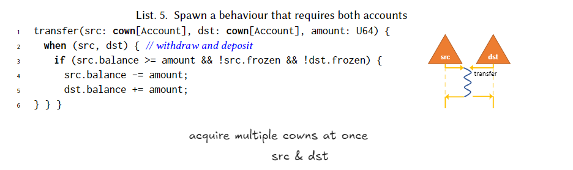
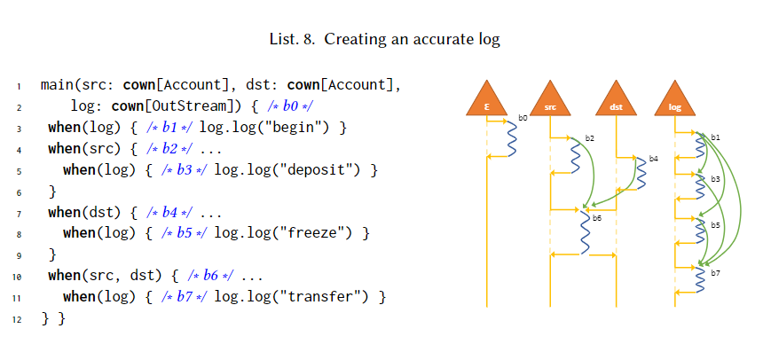
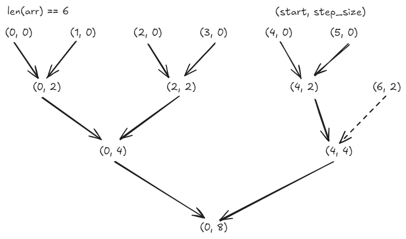

# Behaviour-Oriented Concurrency

Package boc is a Go implementation of [paper] "When Concurrency Matters: Behaviour-Oriented Concurrency" in OOPSLA2023. It's a coarse-grained concurrency pattern which coordinates parallelism and concurrency.

Use `go get -u github.com/Lslightly/boc` to download and upgrade to the latest module.

See [Documentation] for more details.

## Examples

### Transfer

When tranfering money, acquire multiple concurrent owners(cown), here `src` and `dst` at the same time, transfer the money and release them after the transfer.

### More Complex Transfer with Log

After acquiring `src`, acquire `log` to write the log.

### Merge Sort

- Cown Type 1: Nodes in the graph indicate the range of array to sort.
- Cown Type 2: Directed edges indicate the communication channel between nodes.

Once the dependencies are satisfied, the node can start to sort the array.

## Limitations

1. Coarse-grained control of resources. All resources have to be released after the `when` statement.
2. The dependencies have to be hard coded within one module.
3. Deadlock can still occur.

> this is not my opinion but the result of discussion with someone else.

## Credits

This package is rewritten from [boc.rs].
The benchmark is provided by [kaist-cp/cs431] and rewritten in Go.

> Thanks for authors of [kaist-cp/cs431] and [paper].

## Related

[Actor Model](https://awesome-go.com/actor-model/)

[Documentation]: https://pkg.go.dev/github.com/Lslightly/boc
[boc.rs]: https://github.com/Lslightly-courses/cs431/blob/main/homework/src/boc.rs
[paper]: https://dl.acm.org/doi/10.1145/3622852
[kaist-cp/cs431]: https://github.com/kaist-cp/cs431
